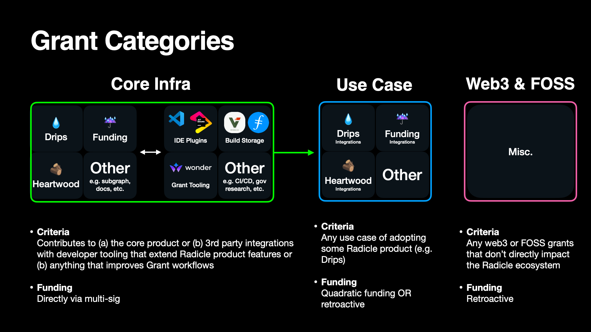

# Radworks Grants Program

- [Introduction](#introduction)
  - [Guidelines](#guidelines)
  - [Requirements](#requirements)
  - [Project ideas](#project-ideas)
  - [Support](#support)
  - [Team](#team)
- [Process](#process)
- [Grant Categories](#grant-categories)
- [Alt Funding Sources](#alt-funding-sources)
  - [Hackathons](#hackathons)
- [Useful Links](#useful-links)

## Introduction

If you're reading this, you're as interested as we are in promoting Free and Open Source Software (FOSS) and the
ever growing Web3 ecosystem.

This page will cover the basics of the Radworks Grants Program's ethos, application processes, and structure.

### Guidelines

The focus is on technical projects that support the developmet of the Radicle & Drips networks. This include: 
- Additions to core Radicle software or components of Web3 infrastructure 
that interact with Radicle
- [Insert Drips note]
- Adoption of some part of the [Radicle stack](https://github.com/radicle-dev) (e.g. [Radicle Drips SDK](https://github.com/radicle-dev/drips-js-sdk))

Below are high level things we look for:

- Your project has **sustainability** front and center. A project that has a plan to be **self-sustaining** and **maintained**
  for the long run will shine above others. We would love nothing more than to have a Radworks grant act as seed funding
  for projects that create value well beyond the grant's initial window.
- Your project is **open source** through and through. It ideally contributes to some core Radworks product features and
  reflects a deep empathy for others working on FOSS. This includes an understanding of the importance of documentation,
  maintainability, extensibility, testing, and clean coding principles.
- You have **strong and relevant** experience. We're looking for pros who have a proven track record in whatever
  language, frameworks, and tooling are needed to get a project past the finish line.

### Requirements 

All work **must** adhere to the following criteria:

#### Open Sourced 
All code produced during your grant must be **open-sourced** with proper licensing (Apache 2.0, GPLv3, MIT or 
Unlicensed).

#### Dependencies 
All code must not rely on closed-sourced software or infrastructure to be fully functioning.

#### Legal and Good Stuff Only
We will not fund projects that support any illicit activity (gambling, money laundering, etc.).

#### Licensing
We take licensing and proper recognition very seriously. We want to celebrate not just your work, but the work
of the giants whose shoulders we are building on. Any attempt to pass work that is not yours off as your own will be
grounds for **immediate termination** of work without pay. Please feel free to start a discussion if you are unsure on
any work.

### Project Ideas

We see project ideas coming from 2 main sources:

#### Open Applications
* If you have an idea for the Radicle, Drips or web3/FOSS ecosystem, we'd love for you to apply. 
* You can file an application using the [template](grants/applications/template.md). More on this in the 
[process](#process) section.

#### [Requests For Proposals](rfps) (RFPs) 
* The Core Development team may create an RFP, but anyone from the community may as well. This helps signal to grant applicants what is most needed in the ecosystem.
* Anyone is welcome to apply to complete the work associated with an RFP.
* We accept applications to tackle RFPs from multiple individuals and teams. This means you may be in competition for a 
grant. Where it makes sense, we may also award one grant across multiple teams.

> 💰 If you write an RFP, you may collect a referral bonus equal to 5% of the total size of any 
associated grant in $RAD that is accepted _**and**_ completed.

No matter the source of the project idea, the entire application process will be transparent and public on Radworks 
channels (e.g. Discourse, Github).

### Support

The scope of support offered by the Radworks Grants Committee includes the following:

- Feedback before/during the application process
- Funding
- Feedback on delivered milestones

Outside of these 3 Fs, the grant will _not_ provide a hands-on assistance or mentorship experience.

We are expecting individuals and teams who are planning to own the work from start to finish.

#### Core Team Involvement 

We are expecting grantees to work closely with their respective Core Development teams. For example, if you are building
a new interface or integration for Drips, you should be working closely to get feedback from them.

For inquiries with the Drips team, please join their [Discord here](https://discord.gg/yWhBZVNu8W).

For inquiries with the Radicle team, please join their [Zulip here](https://radicle.zulipchat.com/).

### Team

#### Radworks Grants Committee

The Grants Committee is the governing body of the Grants Org. This group will act as signers of the Radworks Grant Program's multi-sig, which will ultimately fund projects.

The Radworks Grants Committee is made up of core team members to [Radworks' Orgs](https://docs.radworks.org/community/ecosystem), Radworks community members, and outside folks who have some sort of related domain expertise.

- **Grants Lead:** [Bordumb](https://twitter.com/bordumbb) (Radworks Community)
- [Abbey Titcomb](https://twitter.com/abbey_titcomb) (Core Contributor)
- [Nader Dabit](https://twitter.com/dabit3) (Ecosystem)
- [Nassar Hayat](https://twitter.com/nassarhayat) (Core Contributor)
- Reverie (comprised of [Derek Hsue](https://twitter.com/derek_hsue) and [Larry Sukernik](https://twitter.com/lsukernik) from the Radworks Community)

Below is a record of all of the proposals the Grants Org has submitted to receive funding from Radworks:
- [Radicle Grants Program v1](https://community.radworks.org/t/formal-review-radicle-grants-program-v1/2548)
- [Radicle Grants Program v2](https://community.radworks.org/t/formal-review-radicle-grants-program-v2/2582)
- [2024 Grants Org Proposal](https://community.radworks.org/t/formal-review-rgp-20-grants-org-proposal-2024-v2/3464/2)

#### Radworks Operations Team<!-- omit in toc -->

Speak to anyone on this list if you need help with legal documents or remittances.

- **Grants Lead:** [Bordumb](https://twitter.com/bordumbb) (Radworks Community)
- [Abbey Titcomb](https://twitter.com/abbey_titcomb) (Core Team)

Please see more info in [`/governance` here](https://github.com/radicle-dev/radicle-grants/tree/main/governance)

## Process

As noted, we expect applications to be based on existing RFPs or an open application.

The entire process includes these 3 steps:

#### 1. [Application & Review](https://github.com/radicle-dev/radicle-grants/tree/main/grants/applications)

#### 2. [Milestone Delivery](https://github.com/radicle-dev/radicle-grants/tree/hyperlinkFixes/grants/milestone_deliveries) & [Milestone Evaluation](https://github.com/radicle-dev/radicle-grants/tree/hyperlinkFixes/grants/milestone_evaluations)

#### 3. [Payment](https://github.com/radicle-dev/radicle-grants/tree/main/grants#payment)

## Grant Categories

The community has mandated the Grants Org focuses on funding work that falls within the following categories in 2024:

### 1. Integrations & Tooling
Projects that touch (a) the core source code, (b) extend core features through 3rd party integrations, or \
(c) enhance our own Grants work, such as R&D or Grants infrastructure.

For example, building plug-ins for popular IDEs like JetBrains that utilize the Radicle CLI.

Previous example(s):
* 3rd Party Integration: [IDE - Jetbrains Plugin #1](https://radicle.community/t/application-radicle-jetbrains-ide-plugin-implementation-phase-1/2887)
* 3rd Party Integration: [IDE - VSCode Plugin #1](https://radicle.community/t/application-radicle-vs-code-extension-implementation-phase-1/3099)
* 3rd Party Integration: [Package Management - Research](https://radicle.community/t/grant-application-package-manager/3122/10)
* Governance Research: [DAO Governance - Research](https://radicle.community/t/application-radicledao-governance-design-apiary/3126/11)

### 2. Other Radworks
Projects that adopt some Radicle product feature, such as the Drips SDK.

For example, using Radicle Drips as the infrastructure to help build an HR/payroll system or research crowdfunding 
system.

Previous example(s):
* ADD ???????

### Hackathons

Radworks may organise, sponser, or in some capacity of another participate in hackathons.

These can be a great avenue for funding.

Below is a list of hackathons Radworks has sponsored in the past:

- [ETHGlobal](https://online.ethglobal.com/)
- [Ceramic - Sovereign Data Hackathon](https://gitcoin.co/hackathon/ceramic-identity/onboard)

## Useful Links

|  |  |  |  |  |  |  |
| :-: | :-: | :-: | :-: | :-: | :-: | :-: |
| [@radworks_](https://twitter.com/radworks_)  | [Discord](https://discord.gg/radworks) | [Discourse](https://community.radworks.org/) | [Radworks Docs](https://docs.radworks.org/) | [Gnosis Safe](https://gnosis-safe.io/app/eth:0x394B920c5d39E0Ca40fCa2871569B6B90D750c7c/balances) |

## License

[MIT Licence](https://github.com/radicle-dev/radicle-grants/blob/main/LICENSE) © Radicle
