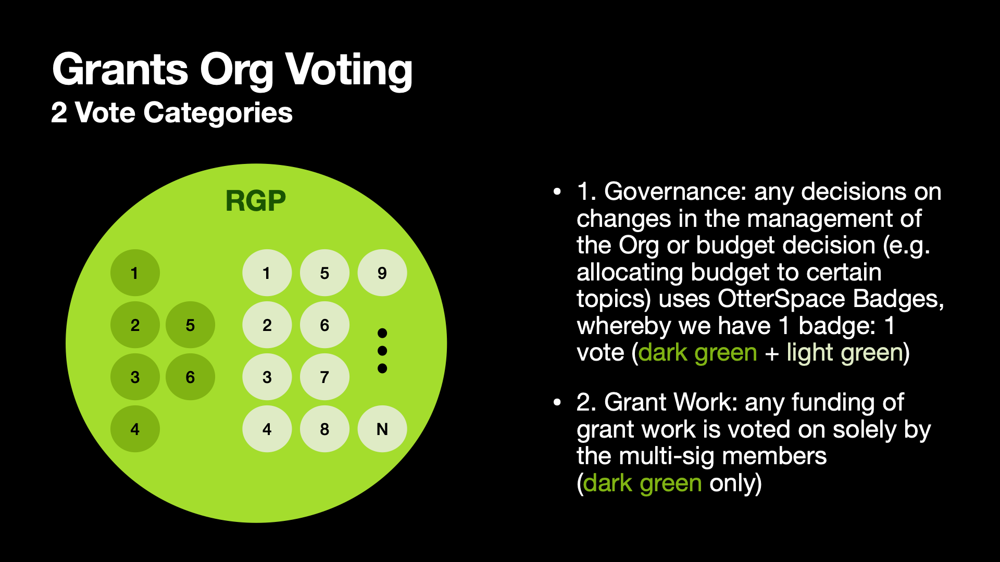

# Grants Org Design Proposal

## Introduction

This page outlines the Grants Org design.

The Grants Program has since its inception been a bit of an outlier in that it was never part of the Foundation to begin with; it was the first sub-DAO spun off.

With that said, this page aims to outline a few changes that keep the Grants Program aligned with the rest of the greater Radicle DAO and its developing sub-DAOs. 

> Note: for more on that, please reference [the larger discussion here](https://radicle.community/t/the-next-phase-of-the-radicledao/2776).

This page will answer the following questions:
* Mission: what is the Radicle Grants Program (_RGP Org_) focused on?
* Funding/Continuity: how will the _RGP Org_ be funded going forward?
* Contributors: who makes up the _RGP Org_ and who counts as a "contributor"?
* Governance/Voting: how are decisions made?

## 🎯 Mission

The _RGP Org_'s goal is simple:

> To find, fund, and guide research and development of any projects that fall outside the purview of the Core Development Org.

Past projects include things like: 
* [Development of JetBrains IDE Plugin](https://radicle.community/t/radicle-jetbrains-ide-plugin-0-5-x/3221)
* [Development of VS Code IDE Plugin](https://radicle.community/t/application-radicle-vs-code-extension-implementation-phase-1/3099)
* [OtterSpace badges for scaling governance](https://radicle.community/t/otterspace-soulbound-contributor-badges-for-daos-grant-application/2868)
* [Research into binary storage](https://radicle.community/t/grant-application-package-manager/3122/11)

More broadly, the _RGP Org_ is open to funding the following grant categories:

## 💰 Funding & Continuity

Nothing with funding is changing with the _RGP Org_'s design. This includes compensation for Committee Members, as outlined in [the original Grants Program Proposal in 2021](https://radicle.community/t/formal-review-radicle-grants-program-v2/2582#compensation-7).

If/when funds should run out, a new Org proposal will be made.

> Note: ideally, the Grant Committee will put forth a proposal well in advance of funds running out.

In the event that the next proposal is unsuccessful for any reason, the current _RGP Org_ will be considered disbanded and anyone else is welcome to create a new proposal and team.

## 👥 Contributors 

> Note: this section represents a major change when comparing to [the latest approved Grants Program proposal here](https://radicle.community/t/formal-review-radicle-grants-program-continuation/3075/).

Within the _RGP Org_, a contributor is anyone who contributes _and_ holds voting power within the Org.

Since the Grants Program's inception, Committee Members have been the only group with voting power.

However, with the funding and testing of [OtterSpace badges](https://radicle.community/t/otterspace-soulbound-contributor-badges-for-daos-grant-application/2868), we are adding grantees as voting members.

More on how voting works across these 2 groups below.

## 🏛️ Governance/Voting

> Note: this section represents a major change when comparing to [the latest approved Grants Program proposal here](https://radicle.community/t/formal-review-radicle-grants-program-continuation/3075/).

Continuing from the last section on **Contributors**, this section outlines how each badge holding group can vote.

There are 2 types of votes:
* Governance (OtterSpace): Committee Members + Grantees
* Grant Work (Gnosis Safe): Committee Members only

For more information - including how to onboard your own DAO to OtterSpace - [please see our docs here](https://github.com/radicle-dev/radicle-grants/tree/main/governance/voting).

# 

| Author(s): | bordumb               |
| --- |-----------------------|
| Type: | Org                   |
| Created: | 2023-03-23            |
| Status: | active                |
| Discussion: | https://radicle.community/t/discussion-radicle-grants-program-org-proposal/3274             |
| Formal Review: | Link to Snapshot vote |
| Submission: | Link to Submission    |

## **Purpose**

The _RGP Org_'s goal is simple:

> To find, fund, and guide research and development of any projects that fall outside the purview of the Core Development Org.

Past projects include things like: 
* [Development of JetBrains IDE Plugin](https://radicle.community/t/radicle-jetbrains-ide-plugin-0-5-x/3221)
* [Development of VS Code IDE Plugin](https://radicle.community/t/application-radicle-vs-code-extension-implementation-phase-1/3099)
* [OtterSpace badges for scaling governance](https://radicle.community/t/otterspace-soulbound-contributor-badges-for-daos-grant-application/2868)
* [Research into binary storage](https://radicle.community/t/grant-application-package-manager/3122/11)

More broadly, the _RGP Org_ is open to funding the following grant categories:

## Annual Strategy & Quarterly Objectives

### Recruiting

**Goal:** Onboard grantees to more permanent work within the Radicle ecosystem.

**Philosophy:** The aim with this is to provide a model for other DAOs on how to uplevel casual contributors into more permanent or regular work.

**KPIs:**
* Easy: bring 1 grantee team to the level that they can either spin off their own Org or join an existing one in a more permanent working engagement.
* Hard: bring 2+ grantee teams to that level.

**Reasoning & Analysis:**
* **How?:** we will make a point about not keeping grantees tethered or beholden to Grant funding, but instead - where it makes sense - encourage them to work directly with the main RadicleDAO, other sub-DAOs, or spin off their own sub-DAO through a new proposal.
* **Contribution to growth:** in cases where a grantee is working on an important enough problem, bringing them into the fold of more permanent work will mean putting resources behind solving important problems for the RadicleDAO at large, as well as their entire Radicle ecosystem.

### Dogfooding

**Goal:** Utilize Radicle products for both (a) the payment of grants via Drips and (b) the organization of work via CodeCollab. 

**Philosophy:** The aim with this is to create a positive feedback loop on product development, as well as to provide a model for other DAOs who may look to us for successful use cases of our products.

**KPIs:**
* Easy: run 100% of Grants payouts via Drips V2
* Hard: incentivize 100% of Grantees to use Radicle CodeCollab for their work.

**Reasoning & Analysis:**
* **How?:** 
* **Contribution to growth:**

### Drip to Dependencies 

**Goal:** Drip to the _RGP Org_'s dependencies.

**Philosophy:** We should exemplify what Radicle is all about:

**KPIs:**
* Easy: allocate 4% (40,000 USDC) of budget to Drips balance + drip to 4 dependencies [as outlined here](https://github.com/radicle-dev/radicle-grants/issues/60).
* Hard: onboard all teams behind the 4 dependencies to at least 5 of their own dependencies, such that they split the incoming Drips from us further down the line. The aim being to kick off some network effects via Drips.

**Reasoning & Analysis:**
* **How?:** 
* **Contribution to growth:**

## ****Reasoning & Analysis****

<aside>
👉 

* How will this Org achieve what it aims to do? 
* How will it solve the problem(s) being called out? 
* How would this Org contribute to the long-term resilience, sustainability and/or growth? 

Why does the solution and execution of this proposal make sense?

</aside>

## **Reporting & Success Criteria**

## Organizational Structure

### 🏛️ Governance/Voting

> Note: this section represents a major change when comparing to [the latest approved Grants Program proposal here](https://radicle.community/t/formal-review-radicle-grants-program-continuation/3075/).

Continuing from the last section on **Contributors**, this section outlines how each badge holding group can vote.

There are 2 types of votes:
* Governance (OtterSpace): Committee Members + Grantees
* Grant Work (Gnosis Safe): Committee Members only

For more information - including how to onboard your own DAO to OtterSpace - [please see our docs here](https://github.com/radicle-dev/radicle-grants/tree/main/governance/voting).

More on how these voting types maps to our contributors below.

### Contributors

Within the _RGP Org_, a contributor is anyone who contributes _and_ holds voting power within the Org.

Since the Grants Program's inception, Committee Members have been the only group with voting power.

However, with the funding and testing of [OtterSpace badges](https://radicle.community/t/otterspace-soulbound-contributor-badges-for-daos-grant-application/2868), we are adding grantees as voting members.

## Communication

The most up-to-date information on the management of the RGP Org can be found in [our repo here](https://github.com/radicle-dev/radicle-grants).

For miscellaneous questions and comments, anyone can reach out on our [Discord here in **Grants - 💬# general**](https://discord.gg/2mN3fys8vZ).

Grant applications and the review of grants is entirely public and carried out on the [Grants Discourse page here](https://radicle.community/c/grants/24).

## Timeline & Budget

<aside>
👉 State a clear annual budget needed to support this Org, as well as a timeline for use of funds. 

Please follow the supplemental [budget template](https://docs.google.com/spreadsheets/d/1zswOWuPEhw37GrY0ekURa5_4TLoDx9OcROXpOtLNwMs/edit#gid=994308978). 

Include any planned hires in this budget summary.

</aside>

<aside>
❗ All Org proposals in 2023 will be asked to present a budget for funding until the end of the calendar year. This means the budget period will change based on when the proposal is passed (e.g. April = 9 months, July = 6 months, October = 3 months etc…)

</aside>

## Fund Management

<aside>
👉 Outline fund management structure and protocol. How will DAO funds be secured? How will contributors be paid out? At what cadence? How will DAO funds be recovered in case of emergency?

</aside>