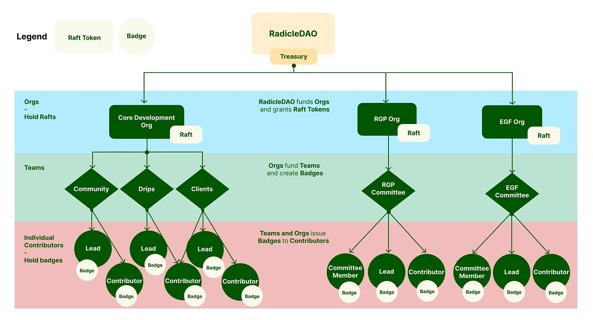

# Badge Management 

If you are the member of a DAO's multi-sig and help manage governance and interested in badge management, this is the page for you.

> Note: for more context on badge-based governance, see the [OtterSpace Temperature Check here](https://community.radworks.org/t/temperature-check-use-otterspace-non-transferable-tokens-for-distribution-of-influence-mechanism/3055).

> Note: all the details below assume we are on the Optimism Network, which OtterSpace is using prior to moving to Ethereum Mainnet. 

## Overview 



Our high-level plan is to confer badges to each Org's contributors (however they are defined).

Some aims with this are:
* Push smaller decisions (e.g. Org level) from the Council down to the Orgs themselves 
* Distribute voting power amongst Org contributors
* Allow for one-person-one-vote governance participation
* Allow for intra-Org voting strategies to evolve without the limitations of a multi-sig

The important thing to keep in mind is: the process that one of our sub-DAOs creates can be largely replicated across others. It is very "copy/paste-able."

## Technical Notes 

The process below covers setting up an Org/Sub-DAO's admin account, community page, creating and issuance of badges, and how to use badges with Snapshot voting.

### Initial Setup
* Make sure you have a wallet address on Optimism network (personal or Gnosis Safe).
* Get [Raft Token](https://docs.otterspace.xyz/your-guide-to-otterspace/how-communities-are-represented-within-otterspace) from OtterSpace team sent to that wallet address.
* When signing-in using Gnosis Safe, make sure it is set to the Optimism network ([more docs](https://docs.otterspace.xyz/your-guide-to-otterspace/using-a-gnosis-safe-with-otterspace)).
* When signing-in using Metamask, make sure it is set to the Optimism network.
* Make sure your Org has a community page. Ask the OtterSpace team for help with this. 

### Minting / Conferring Badges
* Create a badge for each of the contributor groups you'd like to define ([more docs](https://docs.otterspace.xyz/your-guide-to-otterspace/creating-a-new-badge-for-your-community)).
  * See [OtterSpace's Figma doc here](https://www.figma.com/community/file/1165222532286501657) for design templates. Badges immutable, so the design can only be made this once.
* If using a Gnosis Safe, make sure that you are on the _Apps_ -> _Wallet Connect_ app page and logged into OtterSpace on the Optimism Network. Keep this open in its own tab.
* Navigate the badge you'd like to send to a contributor and add their ENS or wallet address to the mint list so that they can claim their badge ([more docs](https://docs.otterspace.xyz/your-guide-to-otterspace/adding-members-to-the-mint-list-for-a-badge)).
* Confirm the transaction in your wallet. If using a Gnosis Safe, you'll confirm this back in the _Apps_ -> _Wallet Connect_ app page.
* Share claim link to your contributors ([more docs](https://docs.otterspace.xyz/your-guide-to-otterspace/sharing-the-badge-claim-link-with-members)).

### OtterSpace x Radworks Grants x Snapshot Votes
* Create a Snapshot page for your sub-DAO on Optimism network ([Snapshot Docs](https://docs.snapshot.org/spaces/create)).
  * Radworks Grants: https://snapshot.org/#/radiclegrants.eth
* Go to _Settings_ -> _Strategie(s)_, and add a policy for OtterSpace badges ([OtterSpace docs](https://docs.otterspace.xyz/your-guide-to-otterspace/using-otterspace-badges-with-snapshot) / [Snapshot Docs](https://docs.snapshot.org/strategies/what-is-a-strategy)).

Below is what the strategy for the Radworks Grants Org (RGO) looks like.

In plain English, it says:
* This is a `BADGES` voting policy for Raft Token `75` (the RGO OtterSpace community).
* Allow holders of the Team Member Badge (`bafyreiesiztwxc3gzi3asjggpey7symzwnihf3viz7k6rkaqtbvebavfwm`) to vote, with a weight of `1`.
* Allow holders of the Grantee Badge (`bafyreicev2vael2hl52ww52k54ujn4roewzifelwmpe4mlfxng4bvqsq3a`) to vote, with a weight of `1`.

``` 
{
  "symbol": "BADGES",
  "raftTokenId": "75",
  "specs": [
    {
      "id": "bafyreiesiztwxc3gzi3asjggpey7symzwnihf3viz7k6rkaqtbvebavfwm",
      "weight": 1
    },
    {
      "id": "bafyreicev2vael2hl52ww52k54ujn4roewzifelwmpe4mlfxng4bvqsq3a",
      "weight": 1
    }
  ]
}
```

> Note: multiple strategies can be added to each Org. Additional policies covering other Org's Raft Token + Badge IDs allow other Orgs' members to participate in another Org's votes. We can call this "intra-Org" voting.
